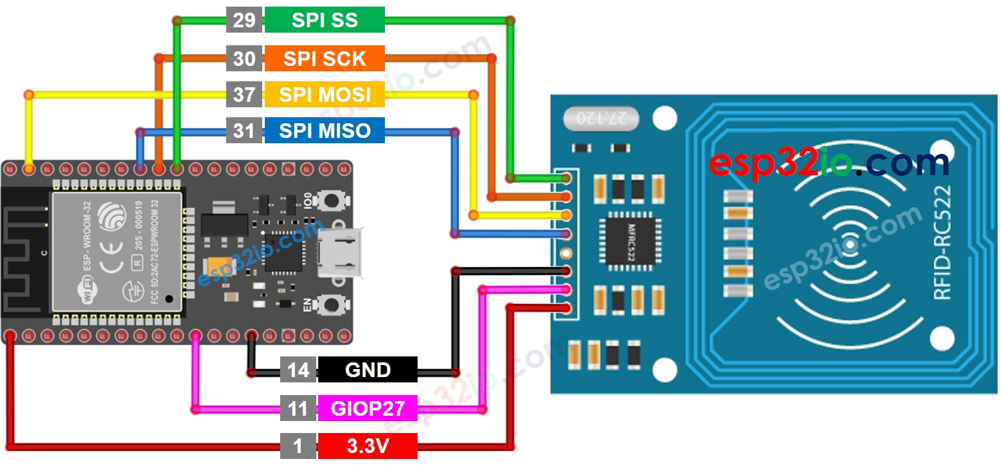

This project is part of the nfc-door-control-system: https://github.com/l-nn-rt/nfc-door-control-system

# Software requirements
* PlatformIO to upload the software to the esp32 (We recommend PlatformIO extension for vscode)

# Hardware requirements

* ESP32 microcontroller
* RC522 NFC-Reader module. A different module can be used (eg the pn532 module). Then the [NFCReader](./lib/nfc/src/NFCReader.cpp) class  has to be changed.

# Wiring

* A relay can be connected to DC_DOOR_OPEN_PIN and GND. HIGH is given to that pin to open the door. Behavior of the pin can be modified in the [Door](./lib/door/src/DoorOpener.cpp) class.
* A bell can be connected to BELL_PIN and GND. To ring the bell LOW has to be given to the pin. Behavior of the pin can be modified in the [Doorbell](./lib/door/src/Doorbell.cpp) class.
* A alarm device can be connected to ALARM_PIN and GND. The esp gives high to that pin if the Doorbell rings. Behavior can be changed in the [Alarm](./lib/notification/src/Alarm.cpp) class.
* Wiring of the NFC-Reader module according to the following diagram (in case RC522 is being used):


# Installation

* Replace [certificate.pem.crt](./certs/certificate.pem.crt) and [private.pem.key](./certs/private.pem.key) with your own ssl certificate and key. The files are only recognized if they are named exactly like the placeholders.
* Go to build_flags in [platformio.ini](./platformio.ini) and change the following macros:
    * WIFI_SSID and WIFI_PASSWORD. The esp will print it's IP address to the serial monitor if it managed to connect to WiFi.
    * DC_MDNS if you want a MDNS for the esp.
    * DC_MIDWARE_URL must be set to the base url of the midware. Including the terminating '/'!!!
    * PSKEY must be set to the same pre-shared-key as in the midware.
    * TOKEN_SEED must be set to the same token seed as in the midware.
    * Alarm and door open duration can be adjusted with DOOR_OPEN_DURATION_MILLIS and ALARM_DURATION_MILLIS respectively.
    * The remaining macros can be changed but it's not recommended. For example the capacity of the database can be increased but is bound by flash size.
* Connect the ESP32 to a USB port via Micro USB cable or USB to UART bridge.
* Use PlatformIO to upload to the esp32. To do that in vscode enter "PlatformIO: Upload" in the command palette.

# API Documentation

The base URL of the ESP32 will be `http://dc.local/` or `http://$(IP)/` if `DC_SERVER_SECURE=false` and `https://dc.local/` or `https://$(IP)/` if `DC_SERVER_SECURE=true`.

For all requests provide the Pre-Shared-Key in the header `psk`.

Note that the NFC-Tokens on the ESP32 are seeded. So if you want to insert the NFC-Token `1234abcd` you need to insert `sha256(tokenSeed + 1234abcd)` into the database.

## Open the door.

**URL:** `/door/`

**Method:** `POST`

**Authentication required:** Yes

**Data constraints:**

No data constraints.

### Success Response
**Condition:** The Pre-Shared Key is valid.

**Code:** `200 OK`

**Content example:** `{}`

### Error Response

**Condition:** Invalid json/missing field.

**Code:** `400 BAD REQUEST`

**Content example:**
```json
{
    "msg": "$(description)"
}
```

**Condition:** The Pre-Shared Key is invalid.

**Code:** `401 NOT AUTHORIZED`

**Content example:**
```json
{
    "msg": "$(PSK) is invalid"
}
```

**Condition:** Internal error.

**Code:** `500 INTERNAL SERVER ERROR`

**Content example:**
```json
{
    "msg": "$(description)"
}
```

## Delete tokens from the database.

To remove `1234abcd` you need to calculate `sha256(tokenSeed + 1234abcd)` and put that into tokens.

**URL:** `/token/`

**Method:** `DELETE`

**Authentication required:** Yes

**Data constraints**
deleteAll or tokens must be set.

| Name               | Description                                               | Type   | Optional |
| ------------------ | --------------------------------------------------------- | ------ | -------- |
| deleteAll          | If true reset the whole database                          | bool   | ✔️       |
| tokens             | The tokens to delete. | List of Strings | ✔️ |

**Data example (deletes 3 Tokens):**
```json
{
    "deleteAll": false,
    "tokens": [
        "1234567",
        "3456789",
        "2345678"
    ]
}
```

### Success Response

**Code**: `200 OK`

**Content example:** `{}`

### Error Response

**Condition:** Invalid json/missing field.

**Code:** `400 BAD REQUEST`

**Content example:**
```json
{
    "msg": "$(description)"
}
```

**Condition:** The Pre-Shared Key is invalid.

**Code:** `401 NOT AUTHORIZED`

**Content example:**
```json
{
    "msg": "$(PSK) is invalid"
}
```

**Condition:** Internal error.

**Code:** `500 INTERNAL SERVER ERROR`

**Content example:**
```json
{
    "msg": "$(description)"
}
```

## Get a hash of all tokens stored on the microcontroller.

Returns a hash of all seeded NFC-Tokens in lower hexadecimal represenation sorted lexicographically.

**URL:** `/token/`

**Method:** `GET`

**Authentication required:** Yes

**Data constraints:**

No data constraints.

### Success Response

**Code**: `200 OK`

**Content example:** `{}`

### Error Response

**Condition:** Invalid json/missing field.

**Code:** `400 BAD REQUEST`

**Content example:**
```json
{
    "msg": "$(description)"
}
```

**Condition:** The Pre-Shared Key is invalid.

**Code:** `401 NOT AUTHORIZED`

**Content example:**
```json
{
    "msg": "$(PSK) is invalid"
}
```

**Condition:** Internal error.

**Code:** `500 INTERNAL SERVER ERROR`

**Content example:**
```json
{
    "msg": "$(description)"
}
```

## Adds/Replaces token to/in database.

Note that the NFC-Tokens on the ESP32 are seeded. So if you want to insert the NFC-Token `1234abcd` you need to calculate `sha256(tokenSeed + 1234abcd)` and put that into tokens. Same goes for the token to replace.


**URL:** `/token/`

**Method:** `PUT`

**Authentication required:** Yes

**Data constraints**

| Name            | Description                                               | Type   | Optional |
| --------------- | --------------------------------------------------------- | ------ | -------- |
| tokens          | A list of objects, where toReplace is optional but toPut is required | List of Strings | ✔️      |

**Data example:**
```json
{
    "tokens": [
        {
            "toReplace": "1234567",
            "toPut": "890ABCD"
        }
    ]
}
```

### Success Response

**Code**: `200 OK`

**Content example:** `{}`

### Error Response

**Condition:** Invalid json/missing field.

**Code:** `400 BAD REQUEST`

**Content example:**
```json
{
    "msg": "$(description)"
}
```

**Condition:** The Pre-Shared Key is invalid.

**Code:** `401 NOT AUTHORIZED`

**Content example:**
```json
{
    "msg": "$(PSK) is invalid"
}
```

**Condition:** Internal error.

**Code:** `500 INTERNAL SERVER ERROR`

**Content example:**
```json
{
    "msg": "$(description)"
}
```
